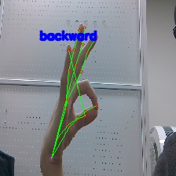

# Robot-Control-with-Hand-gestures
Robot Control with Hand gestures with Yahboom Jetson Nano AI Robot
We completed the application using a pretrained model that was completed in advance without independent gesture learning.   
https://github.com/NVIDIA-AI-IOT/trt_pose_hand

## Getting Started
### Environment
 - python 3.6.9
 - trt_pose 0.0.1
 - pytorch 1.0.0a0
 - sklearn 0.24.2
### Prerequisites
**Step 1 - Download PyTorch and Torchvision for Jetson nano. [link](https://forums.developer.nvidia.com/t/pytorch-for-jetson/72048)**   
**Step 2 - Install [torch2trt](https://github.com/NVIDIA-AI-IOT/torch2trt)**
```
git clone https://github.com/NVIDIA-AI-IOT/torch2trt
cd torch2trt
sudo python3 setup.py install --plugins
```
**Step 3 - Install other miscellaneous packages**
```
sudo pip3 install tqdm cython pycocotools
sudo apt-get install python3-matplotlib
```
**Step 4 - Install trt_poses**
```
git clone https://github.com/NVIDIA-AI-IOT/trt_pose
cd trt_pose
sudo python3 setup.py install
```
**Step 5 - Install dependecies for hand pose**   
```
pip install traitlets
```
**Step 6 -  Download model weight**
| Model | Weight |
|-------|---------|
| hand_pose_resnet18_baseline_att_224x224_A | [download model](https://drive.google.com/file/d/1NCVo0FiooWccDzY7hCc5MAKaoUpts3mo/view?usp=sharing) |
- Download the model weight using the link above.   
- Place the downloaded weight in the [model](model/) directory

**Step 7 -  Open and follow robot_control_with_hand_gestures.ipynb notebook**

## Issues
if you got TLS block issue when import the sklearn in ipynb, add this
```python
import os
os.environ['LD_PRELOAD']
```

## Customize
moving the Robot in real world you should have to change the parameters of Robot movements  for adaptable real world
```python
if gesture_joints == 1: # stop
    robot.stop()
elif gesture_joints == 2: # left
    # at here
elif gesture_joints == 3: # forward
    # at here
elif gesture_joints == 4: # right
    # at this
elif gesture_joints == 5: # backward
    # at this
else:
    robot.stop()   
```

## Running the tests





## References
- [JetCam](http://github.com/NVIDIA-AI-IOT/jetcam) - An easy to use Python camera interface for NVIDIA Jetson
- [JetBot](http://github.com/NVIDIA-AI-IOT/jetbot) - An educational AI robot based on NVIDIA Jetson Nano
- [trt_pose](https://github.com/NVIDIA-AI-IOT/trt_pose) - Real-time pose estimation accelerated with NVIDIA TensorRT
- [deepstream_pose_estimation](https://github.com/NVIDIA-AI-IOT/deepstream_pose_estimation) - [trt_pose](https://github.com/NVIDIA-AI-IOT/trt_pose) deepstream integration
- [ros2_trt_pose](https://github.com/NVIDIA-AI-IOT/ros2_trt_pose) - ROS 2 package for "trt_pose": real-time human pose estimation on NVIDIA Jetson Platform
- [torch2trt](http://github.com/NVIDIA-AI-IOT/torch2trt) - An easy to use PyTorch to TensorRT converter